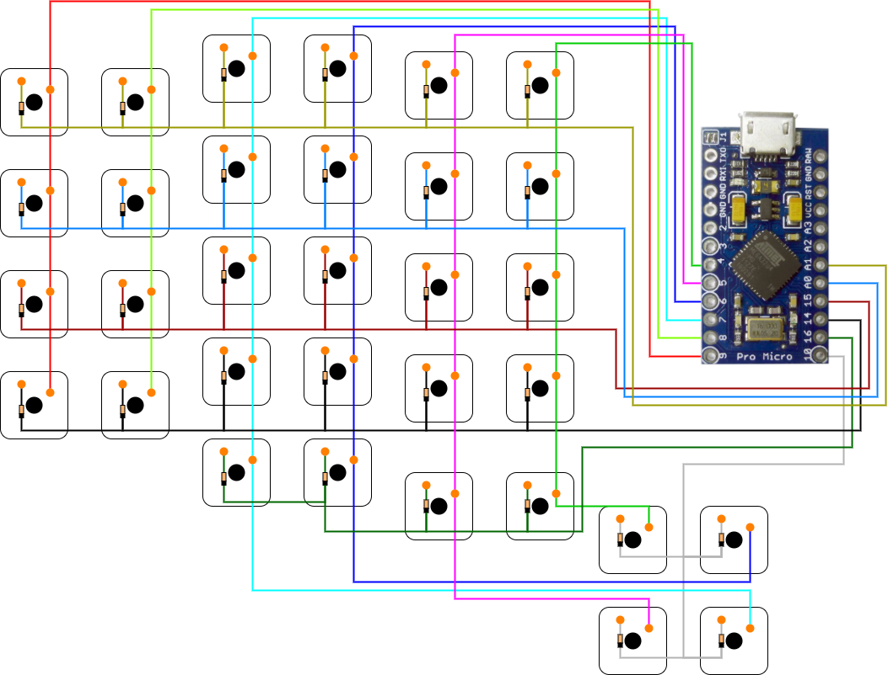

# Custom split keyboard

This repository contains useful info about making custom keyboards, which I find during creating my custom keyboard. First are some useful links about building keyboards, components, shops, ... Second my notes about building keyboard and last some information about software on pro micro like creating keyboard layout or flashing.

## Useful links

Below is some useful information about parts of the keyboard. Every section ends with a few useful links. Links, related to some parts it's in these parts.

### PCB

If you want to have a slim keyboard (_or you just want a PCB for your keyboard_), you will need PCB. You can buy one or design it.

- [Guide for creating PCB](https://github.com/ruiqimao/keyboard-pcb-guide)
- [Colosseum PCB](https://github.com/swanmatch/colosseum60)
- [ErgoDox PCB](https://github.com/Ergodox-io/ErgoDox)
- [Cherry MX PCB](https://github.com/ogatatsu/Cherry-Mx-Bitboard)
- [key switches PCB](https://github.com/daprice/keyswitches.pretty)

### Microcontrollers

There are a few options, Arduino Pro Micro with Atmega32, STM32, Elite C microcontroller (_like Pro Micro, but with USB C and some other improvements_)

- [Pro micro vs Elite article](https://docs.splitkb.com/hc/en-us/articles/360011510839-Pro-Micro-vs-Elite-C-Why-choose-one-over-the-other-)
- [Another microcontroller discussion on Reddit](https://www.reddit.com/r/MechanicalKeyboards/comments/fs7dxb/is_the_atmega32u4_the_best_microcontroller_for/)
- [Firmware QMK documentation](https://beta.docs.qmk.fm)
- [Github project QMK firmware](https://github.com/qmk/qmk_firmware)
- [QMK firmware online configuration](https://config.qmk.fm/#/handwired/dactyl_promicro/LAYOUT_6x6)
- [Github project TKM keyboard firmware](https://github.com/tmk/tmk_core) with firmware for Atmel AVR and Cortex-M

### Shops

- [splitkb](https://splitkb.com/)
- Alternatively as usual amazon and eBay

If you want to buy a split keyboard for yourself:

- [vexc](https://www.vexc-how-design.com/designer-keyboard)

### Switches

About switches are on the web lot of information and opinions. For build is this information unimportant, but if you are building a keyboard, check it and if you can test what is best for you.

- [switch specifications](https://www.reddit.com/r/MechanicalKeyboards/comments/a7stdo/information_on_kailh_choc_switches/)

## Building keyboard

This section contains information about keyboard building.

### Whats you need

- switches
- keycaps
- microcontroller or two if you build a split keyboard(_arduino pro micro in my case_)
- diodes (_to avoid ghosting_)
- USB cable for power
- PCB or wire for connection
- keyboard case

- if you want to build a split keyboard: [TRRS](https://en.wikipedia.org/?title=TRRS_connector&redirect=no), RJ9 or I~2~C connectors and cable

### Building keyboard

Solder keyboard is relatively easy, but it's a lot of soldering. Just hold on wiring schema and everything will be ok.

#### Wiring

Wiring is simple it's only a matrix of key switches. If you want to, you can check [QMK hand wiring documentation](https://docs.qmk.fm/#/hand_wire?id=wiring-the-matrix). There is some very useful information. For information about split keyboard connections, QMK has [documentation](https://docs.qmk.fm/#/feature_split_keyboard) for this too.

Below is the image of wiring for a right hand. The image is from the bottom of the keyboard. If you want the wiring of the left hand, you can mirror this image.



But be careful, if you have arduino pro micro, pins have different names, which can be confusing and in QMK code must be used pin names from spark pro micro (_example of pin names is in code in section pro micro software_). If you want to know the relation between pro micro and arduino pro micro pins names, check [this](https://deskthority.net/wiki/Arduino_Pro_Micro#Pinout).

#### Tutorials

If you want some detailed tutorials, [here](https://sachee.medium.com/building-my-first-keyboard-and-you-can-too-512c0f8a4c5f) is a nice guide about building your dactyl keyboard. You can also check [this](https://github.com/nicinabox/lets-split-guide/blob/master/assembly.md) tutorial. If you rather see a video, you can check [this](https://www.youtube.com/watch?v=y0F8Mig40m0).

## Pro micro software

In this section is some info about pro micro software. I'm using [QMK firmware](https://docs.qmk.fm). If you are solder your matrix to different pins, you can change them in code with:

```C
#define MATRIX_COL_PINS { B5, B4, E6, D7, C6, D4 }
#define MATRIX_ROW_PINS { F6, F7, B1, B3, B2 }
```

Can be also used only for only one side with append define name with side. For example `MATRIX_COL_PINS_RIGHT`.

### Bootloader

Some peoples do not like the default pro micro bootloader Caterina. You can replace it with another. I recommend QMK DFU (_[here](https://www.reddit.com/r/olkb/comments/8sxgzb/replace_pro_micro_bootloader_with_qmk_dfu/) is the guide_) which is extended by a few functionalities against default DFU, but you can use it too (_one guide is [here](https://www.reddit.com/r/olkb/comments/9ctx37/qmk_burn_dfu_bootloader_into_keyboard_with/)_).

### Keyboard layout

Having a good keyboard layout is essential. You can have all your shortcuts near to your finger positions. You can use your normal keyboard layout, but why? About my keyboard layout, I`m writing [here](./czech_keyboard_layout.md), but the text is in Czech. That's my native language and have some specific needs. So if your native language is English or you write primarily in that language, you can check [Dvorak](https://en.wikipedia.org/wiki/Dvorak_keyboard_layout) or [Colemak](https://colemak.com) (_or lookup for other ones_) keyboard layout. But be careful, these layouts are optimized for frequently used characters in English not in other languages.

QMK has [a simple layout creator](https://config.qmk.fm), you can use it to create and test your keyboard layout. This site also can compile QMK with your layout to hex file or you can only download layout in `.json`.

To translate `.json` keyboard layout to `.c` can be used [this side](https://jhelvy.shinyapps.io/qmkjsonconverter/). It's useful when you want to compile and flash your layout by the make of QMK CLI.

[Here](https://docs.qmk.fm/#/keycode) is a list of keycodes for QMK keyboards or if you want it in Github README then check [here](https://github.com/qmk/qmk_firmware/blob/master/docs/keycodes.md)

### Flashing keyboard

For flash your keyboard you can use [QMK Toolbox](https://github.com/qmk/qmk_toolbox) (_but it is not available on Linux_) with GUI, [QMK CLI](https://github.com/qmk/qmk_cli) or make a file in the qmk repository

QMK CLI

```
sudo qmk flash -kb <keyboard> -km <layout>
```

If you want to compile to the hex file, you can use `compile` instead of `flash`.

Make:

```
sudo make <keyboard>:<layout>:flash
```

You can also use make without flash for compilation.

QMK CLI have dependency on `avr-gcc` but be careful, it's recommended to have it in version 8.x. I have no problem with the newest version, but it's good to know.

## Conclusion
